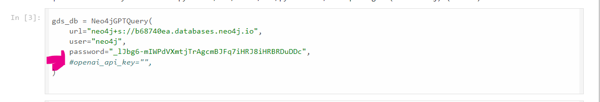

# Knowledge Graph Construction and Question Answering from Biology Textbook
Our project is centered on developing a domain-specific knowledge graph (KG) from a biology textbook. We employ entity and relation extraction models, using tools such as spaCy to extract logical and semantic information from the text. By integrating this KG with the large language model GPT-4 for question-answering, our goal is to deliver responses that are contextually appropriate to the asked questions.
The textbook is already provided in the repository in pdf format.
## Instructions
### Knowledge Graph Construction
To execute our knowledge graph construction code, simply run the command
```
python kg.py
or 
python3 kg.py
```
This will also show the visual representation of the knowledge graph. 

### Question and Answering
The question and answering code is in llm_integration.ipynb which is done in google colab.
We used GPT-4 an LLM for generating cypher to query Neo4j Database.
An openAI API key is required and could be generarted here after opening an account here: https://platform.openai.com/playground.
You have to uncomment and put your api key value in the openai_api_key variable, that is shown in the photo 


To execute the code in Google Colab just click on Run All.
